# 🎓 ZeroCost Academy – E-Learning Website

ZeroCost Academy is a **free E-Learning Website** developed as a **final year Diploma project** for **Computer Engineering** under  
**Dr. Babasaheb Ambedkar Technological University (DBATU), Lonere**.

The platform offers **free technical courses**, **online exams**, **automatic certificate generation**, and an **offline AI chatbot** using the **Ollama Mistral model** — without any paid APIs or subscriptions.

---

## ✨ Features

- User Login & Signup
- Free Online Courses (HTML, CSS, JavaScript, Java, Python)
- Video-based learning with progress tracking
- Online MCQ exams
- Automatic certificate generation (PDF)
- Offline AI Chatbot (Ollama + Mistral)
- Clean and responsive UI

---

## 🛠️ Technology Stack

- Frontend: HTML, CSS, JavaScript  
- Backend: PHP, MySQL  
- AI Chatbot: Ollama (Mistral Model)  
- Tools: XAMPP, Visual Studio Code  

---

## 📂 Project Structure

assets/
auth/
courses/
exams/
certificates/
chatbot/
dashboard/
database/
pages/
NOTES/
index.php

---

## ⚙️ How to Run

1. Install **XAMPP**
2. Copy project to:
C:/xampp/htdocs/ZeroCost-Academy
3. Start **Apache** and **MySQL**
4. Open browser:
http://localhost/ZeroCost-Academy

---

## 🤖 AI Chatbot Setup (Offline)

1. Install Ollama → https://ollama.com  

2. Pull the Mistral model:

ollama pull mistral
Run the chatbot:

ollama run mistral
✔ Works offline
✔ No API key required

🖼️ Screenshots (User Flow Order)
### 🔹 Sign Up Page
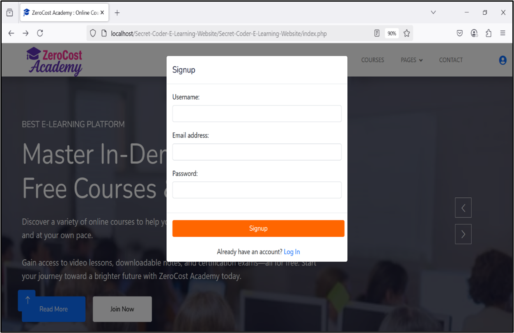

### 🔹 Login Page
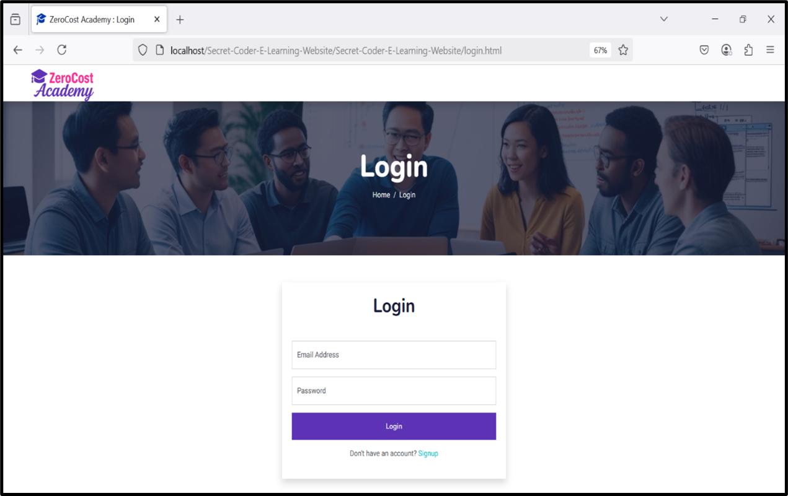

### 🔹 Home Page
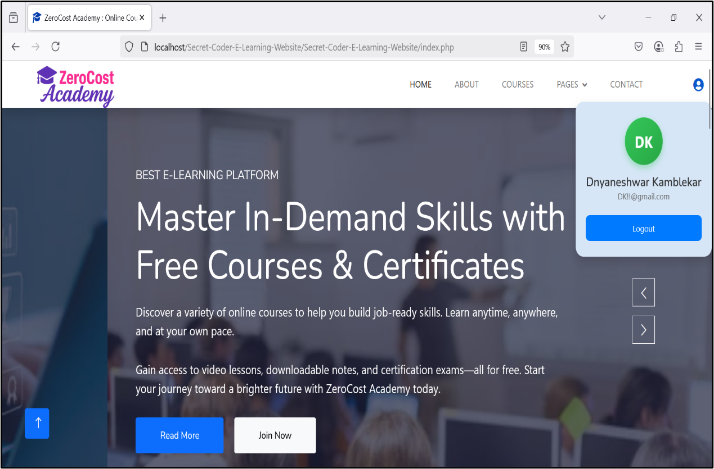

### 🔹 Online Courses
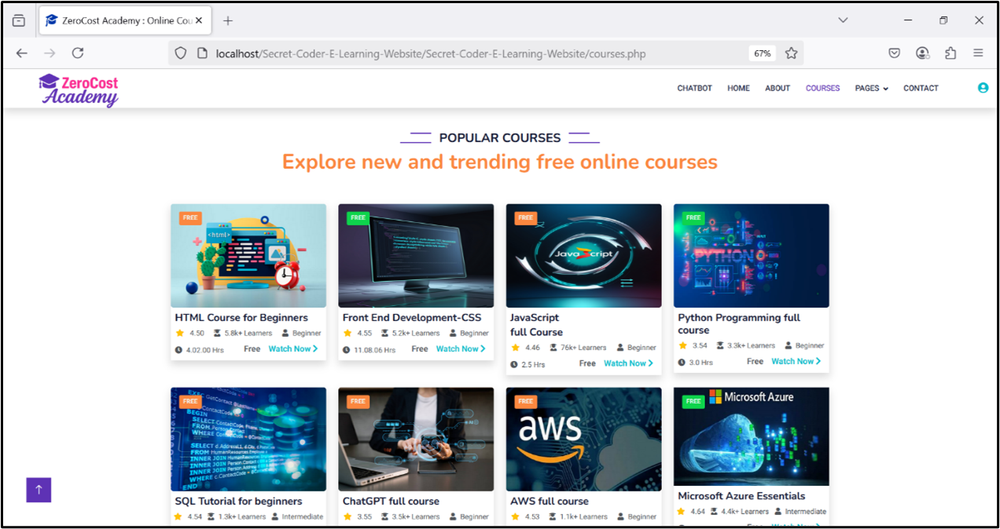

### 🔹 Course Lecture with Video Progress
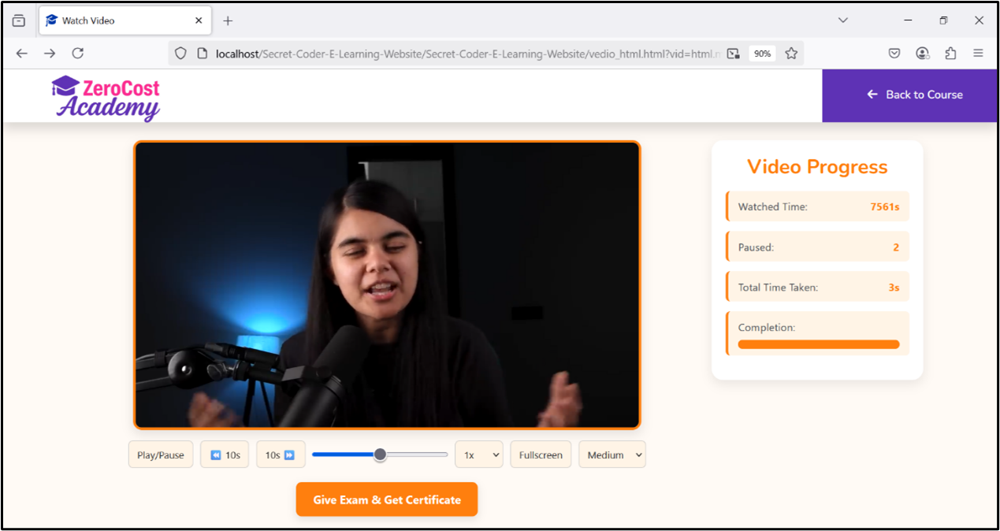

### 🔹 Notes on Various Topics
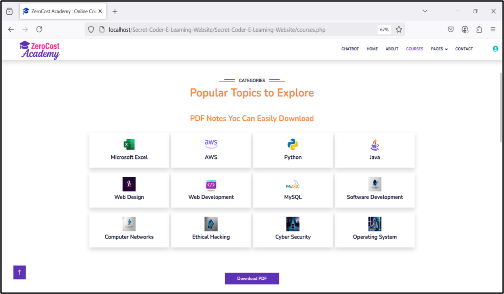

### 🔹 Quick Test on Course
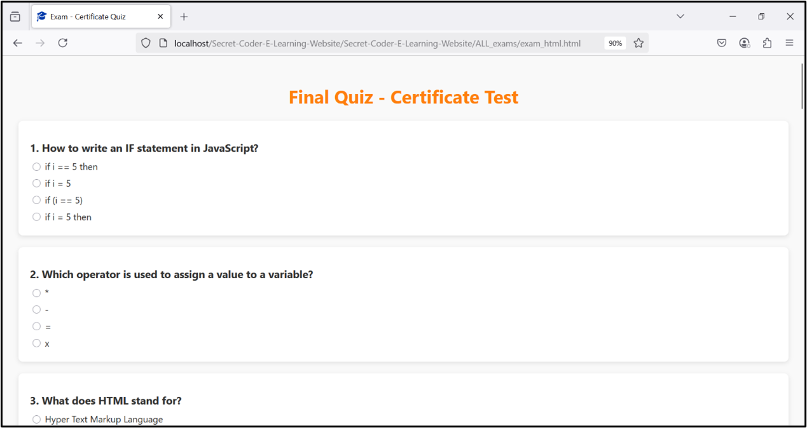

### 🔹 Eligible for Certificate (After Passing Exam)
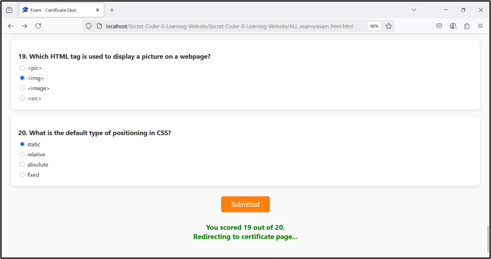

### 🔹 Auto-Generated Certificate (Based on Login Name)
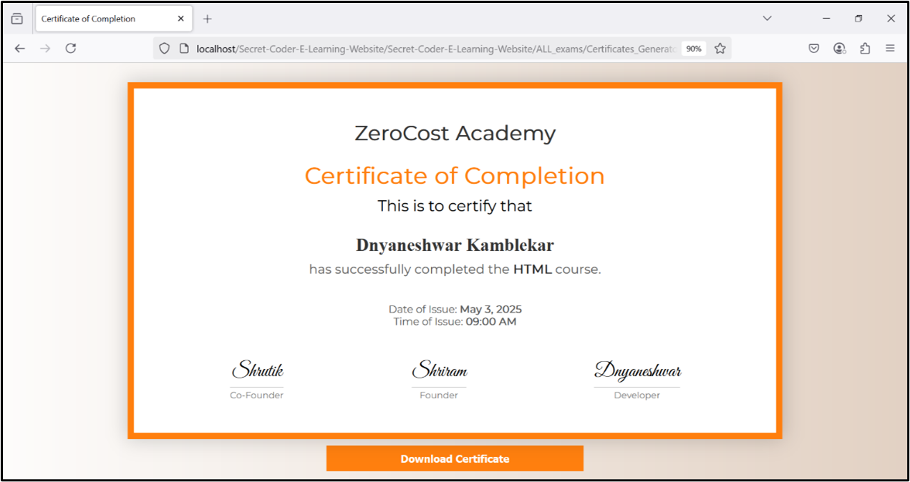

### 🔹 Certificate Download Button
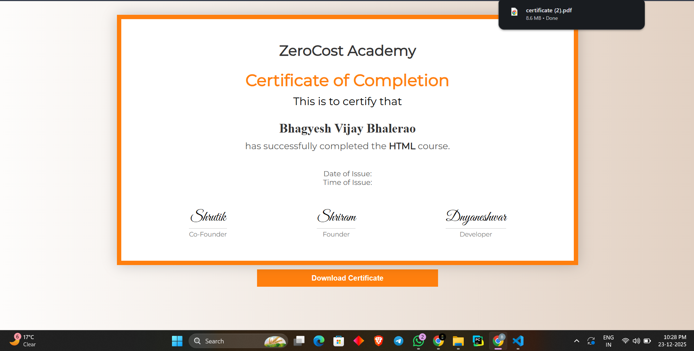

### 🔹 ZeroCost Academy AI Chatbot
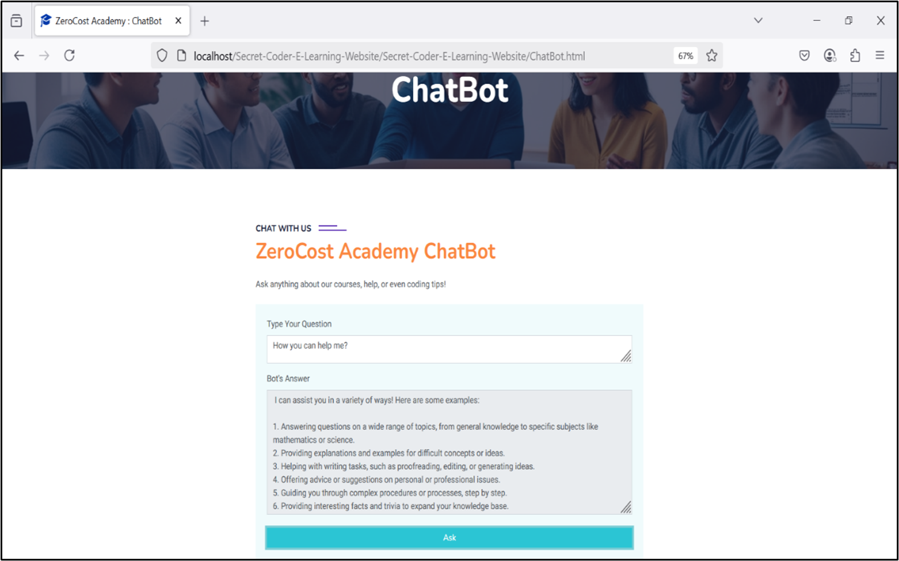

🎓 Academic Details
Project: ZeroCost Academy – E-Learning Website

Course: Diploma in Computer Engineering

University: Dr. Babasaheb Ambedkar Technological University (DBATU), Lonere

Academic Year: 2024–25

👨‍💻 Project Team
Bhagyesh V. Bhalerao

Shriram D. Lahane

Dnyaneshwar Y. Kamblekar

Shrutik S. Kangane

📜 License
This project is developed for academic and learning purposes only.

## ⚠️ Important Note (Project Structure)

> The project folder structure has been **reorganized and cleaned** for better readability and GitHub hosting.
>
> Due to this re-structuring, some **relative file paths (CSS, JS, images, PHP includes)** may need to be **updated manually** before running the project locally.
>
> This change was done **only for GitHub presentation and maintenance** and does **not affect the core functionality** of the application.
>
> Please verify and update paths according to your local setup (e.g., `include`, `require`, asset links).

